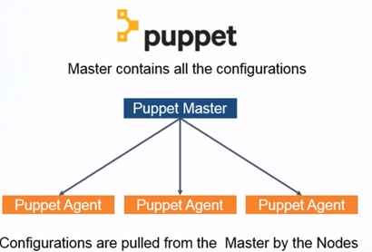
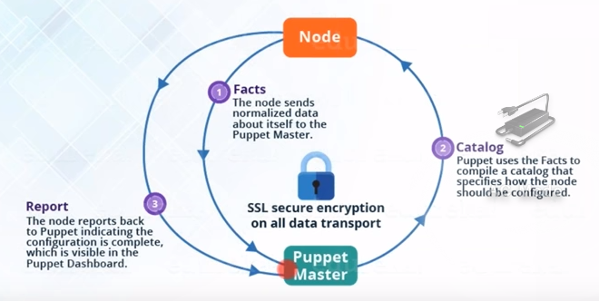
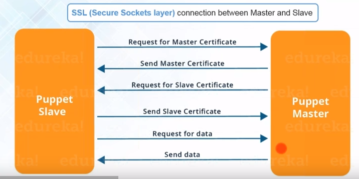

# Puppet
hid-sp18-520 Arjit Sinha
hid-sp18-523 Ritesh Tandon

## Overiew

 Configuration management is an important task of IT department in any organization. It is a process of managing changes in infrastructure in a structured and systematic way.

Configuring large infrastructure has always been a tedious task. Moreover in case of any technical glitches when updating software, manual rolling back the infrastructure to

previous version of the software is time consuming and error prone. Puppet is a configuration management tool that makes the complex task of deploying new software, updating

software updates , rolling back softwares on large cluster easily and in efficient way. Puppet does this through Infrastructure as Code ( IAC ). In this process code is written for

infrastructure on one central location and is pushed to all the nodes in all environments ( Dev, Test, Production ) using puppet as tool. Configuration managment tool has two

approaches for managing infrastructure configuration push and pull. In push configuration, infrastructure as code is pushed from centralized server to the nodes where as in pull

configuration nodes pulls the infrastructure as code from central server. puppet uses pull configuration.


## Master Slave Architecture

Puppet uses master slave architecture. There is puppet master node and client nodes called as puppet agent. Agents poll the server at regular interval and pulls the updated configuration

from the master. Puppet Master is highly available as it supports muti master marchitecture, in case if one goes down backup master stands up to serve the infrastructure. In this architecture-

- nodes ( puppet agents ) sends the information (for e.g IP, hardware detail, network etc. ) to master. Master stores such information in the manifest.

- Puppet master then compiles the catalog which is the information about the configuration that master wants the client resources also known as puppet agent to implement.

- Master sends the catalog to puppet agent nodes to implement the desired configuration.

- Client nodes sends back the updated report to Master

- Connection between master and slave is SSL encrypted ( Refer to Puppet Master Slave Connection figure belwo )










## Installation

- Download the tarball appropriate to your operating system and architecture. For Ubuntu download -ubuntu-<version and arch>.tar.gz

- Import the Puppet public key using below command

```wget -O -  [https://downloads.puppetlabs.com/puppet-gpg-signing-key.pub](https://downloads.puppetlabs.com/puppet-gpg-signing-key.pub)  | gpg --import```

- Print the fingerprint of the key using below command

```gpg --fingerprint 0x7F438280EF8D349F```

- Verify the release signature of the installation package.

```$ gpg --verify puppet-enterprise-<version>-<platform>.tar.gz.asc```

### Install using text mode ( Master / Client based installation)

We have to specify the configuration file (pe.conf) when we install in text mode. This file contains values for the parameters needed for installation.

#### Install the Master

- Unpack the installation tarball:

```tar -xf <TARBALL_FILENAME>```

- From the installer directory, run the installer. The installation steps vary depending on the path you choose.

	+ To use a pe.conf file that you've previously populated, run the installer with the -c flag pointed at the pe.conf file.:

```sudo ./puppet-enterprise-installer -c <FULL PATH TO pe.conf>```

	+ To have the installer open a copy of pe.conf for you to edit and install with, run the installer without the -c flag:

```sudo ./puppet-enterprise-installer```

- When installation completes, transfer the installer and the pe.conf file located at /etc/puppetlabs/enterprise/conf.d/ to the next server that you're installing a component on.

#### Install Puppet DB

In a split installation, after you install the master, you're ready to install PuppetDB.

- Unpack the installation tarball:

```tar -xf <TARBALL_FILENAME>```

- From the installer directory, run the installer:

```sudo ./puppet-enterprise-installer -c <FULL PATH TO pe.conf>```

- When installation completes, transfer the installer and the pe.conf file located at
/etc/puppetlabs/enterprise/conf.d/ to the next server that you're installing a component on.

#### Install the console

In a split installation, after you install the master and PuppetDB, you're ready to install the console.

- Unpack the installation tarball:

```tar -xf <TARBALL_FILENAME>```

- From the installer directory, run the installer:

```sudo ./puppet-enterprise-installer -c <FULL PATH TO pe.conf>```

#### Run Puppet on infrastructure nodes

To complete a split installation, run Puppet on all infrastructure nodes in the order that they were installed.

- Unpack the installation tarball:

## Rest of the Topics are in Progress
